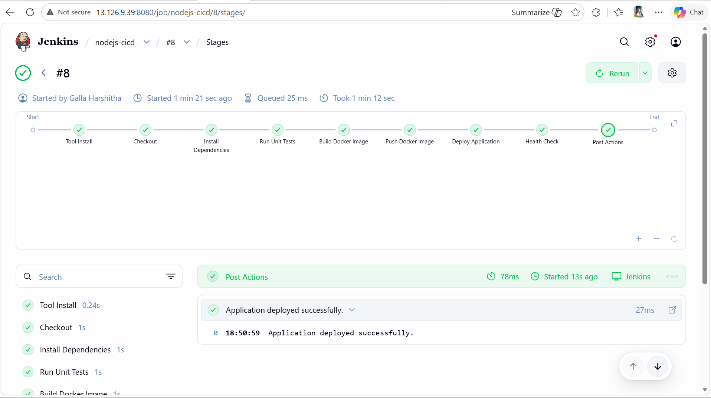
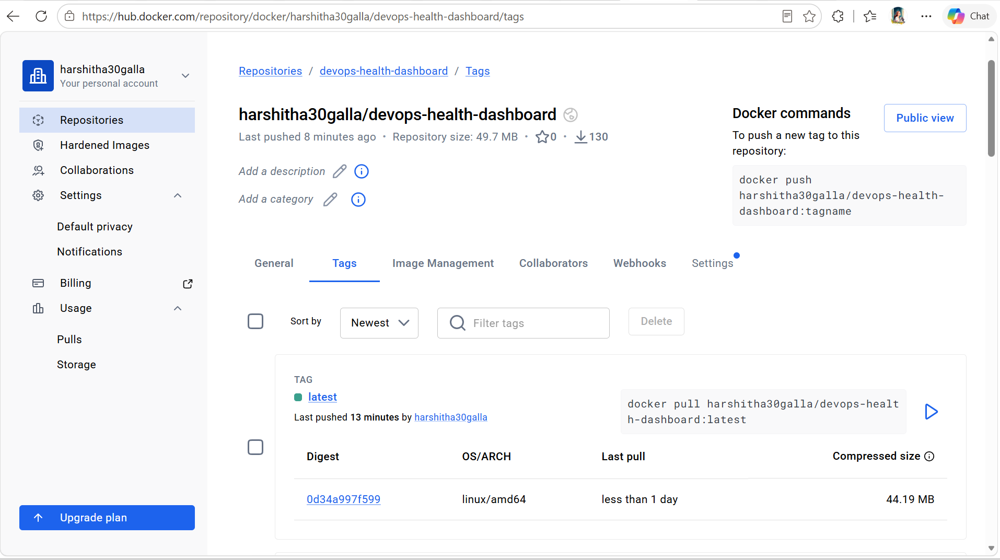
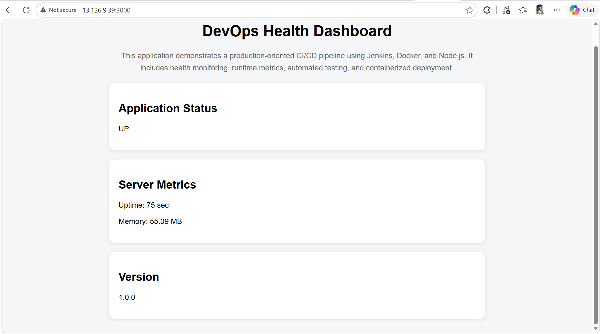
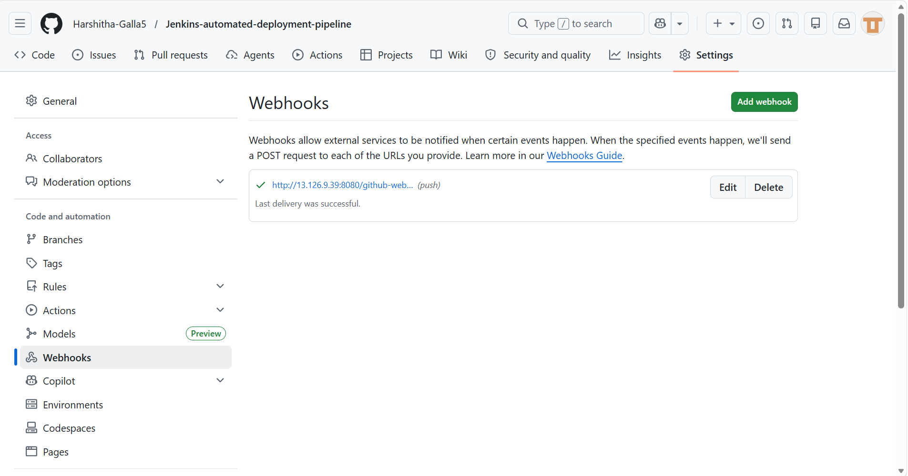
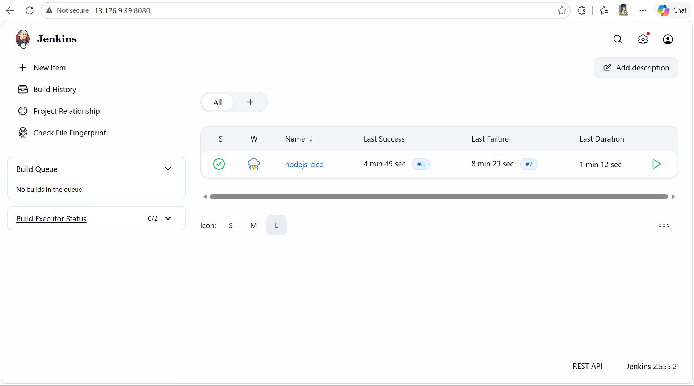

# Jenkins Automated Deployment Pipeline
 <!-- Webhook Test: Triggering Jenkins Build -->
A production-oriented CI/CD pipeline built using Jenkins, Docker, DockerHub, and AWS EC2 to automate the complete application delivery lifecycle.

## Project Overview

This project demonstrates how a DevOps engineer can automate software delivery using Jenkins Pipelines. The workflow automatically fetches source code from GitHub, executes tests, builds a Docker image, publishes the image to DockerHub, and deploys the latest version to an AWS EC2 instance.

## Architecture


### CI/CD Workflow

```text
GitHub Repository
        │
        ▼
Jenkins Pipeline
        │
        ├── Checkout Source Code
        ├── Install Dependencies
        ├── Run Unit Tests
        ├── Build Docker Image
        ├── Push Image to DockerHub
        │
        ▼
AWS EC2 Deployment
        │
        ▼
Application Health Check
```

---

## Technology Stack

| Category           | Technology       |
| ------------------ | ---------------- |
| Source Control     | GitHub           |
| CI/CD Tool         | Jenkins          |
| Application        | Node.js          |
| Testing            | Jest             |
| Containerization   | Docker           |
| Container Registry | DockerHub        |
| Cloud Platform     | AWS EC2          |
| Automation         | Jenkins Pipeline |

---

## Jenkins Pipeline Stages

### 1. Checkout

Pulls the latest source code from GitHub.

### 2. Install Dependencies

Installs required Node.js packages.

```bash
npm install
```

### 3. Run Unit Tests

Executes automated tests.

```bash
npm test
```

### 4. Build Docker Image

Builds a container image for the application.

```bash
docker build -t devops-health-dashboard .
```

### 5. Push Image to DockerHub

Publishes the image to DockerHub.

```bash
docker push <dockerhub-username>/devops-health-dashboard:latest
```

### 6. Deploy Application

Deploys the latest Docker image to AWS EC2 using SSH.

### 7. Health Check

Verifies the application is accessible after deployment.

---

## Jenkins Webhook Integration

GitHub Webhooks are configured to automatically trigger the Jenkins pipeline whenever code is pushed to the main branch.

### Webhook Flow

```text
Developer Push
      │
      ▼
GitHub Webhook
      │
      ▼
Jenkins Pipeline Trigger
      │
      ▼
Automatic Build & Deployment
```

---

## Project Structure

```text
Jenkins-automated-deployment-pipeline
│
├── .github/
│
├── src/
│   ├── app.js
│   └── server.js
│
├── tests/
│   └── health.test.js
│
├── Dockerfile
├── Jenkinsfile
├── package.json
├── package-lock.json
├── .gitignore
└── README.md
```

---

## Screenshots

### Jenkins Pipeline Success



---

### DockerHub Repository



---

### AWS EC2 Deployment



---

### GitHub Webhook Configuration



---

### Jenkins Console Output



---

## Key Features

* Automated CI/CD Pipeline
* GitHub Webhook Integration
* Automated Unit Testing
* Docker Image Creation
* DockerHub Image Publishing
* Automated AWS EC2 Deployment
* Application Health Validation
* Infrastructure Automation
* Secure Credential Management

---

## How to Run Locally

### Clone Repository

```bash
git clone https://github.com/Harshitha-Galla5/Jenkins-automated-deployment-pipeline.git

cd Jenkins-automated-deployment-pipeline
```

### Install Dependencies

```bash
npm install
```

### Start Application

```bash
npm start
```

### Run Tests

```bash
npm test
```

### Build Docker Image

```bash
docker build -t devops-health-dashboard .
```

### Run Container

```bash
docker run -d -p 3000:3000 devops-health-dashboard
```

---

## Learning Outcomes

* Jenkins Pipeline Development
* CI/CD Automation
* Docker Containerization
* DockerHub Integration
* AWS EC2 Deployment Automation
* GitHub Webhook Configuration
* Secure Credential Management
* Infrastructure as Code Concepts

---

## Author

**Galla Harshitha**

Aspiring DevOps Engineer

LinkedIn: https://www.linkedin.com/in/harshitha-galla-343bab345

GitHub: https://github.com/Harshitha-Galla5
